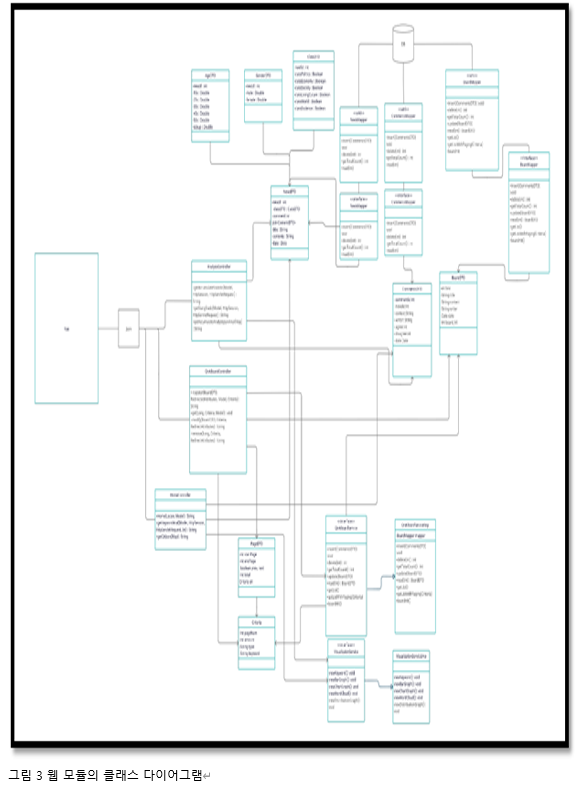
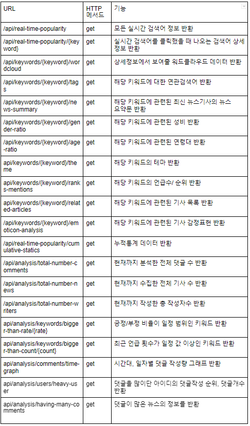
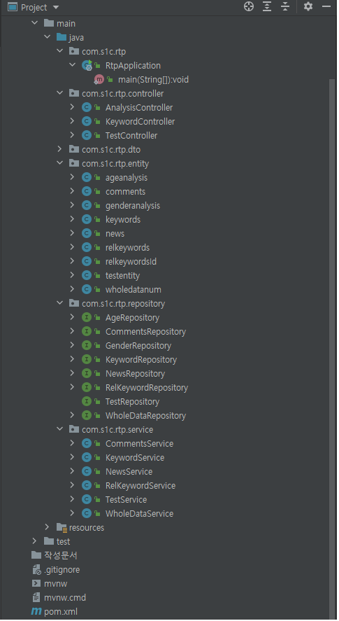
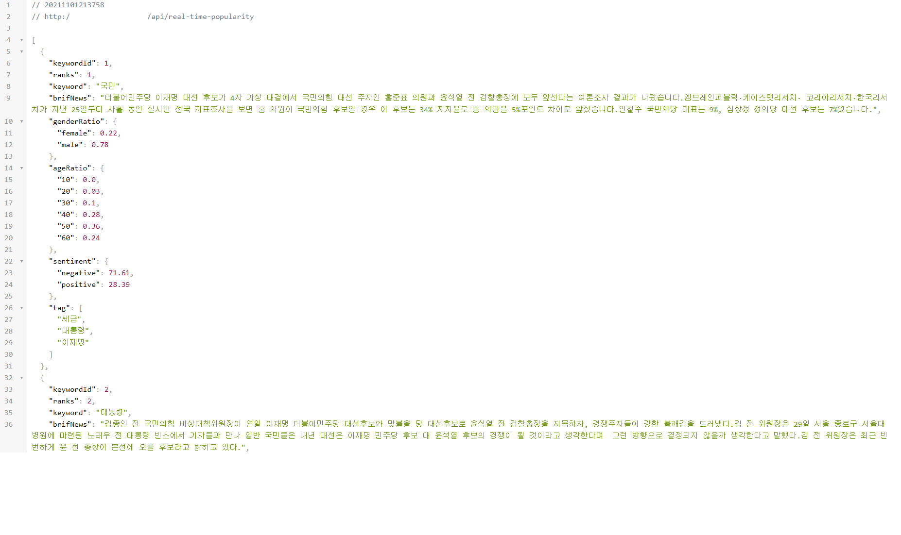


## **빅데이터 기반 댓글 분석 및 시각화 서비스** - 산학연계 프로젝트

(사)한국정보통신기술사협회와 산학연계하여 수행한 프로젝트입니다.  
뉴스의 기사의 댓글들을 분석하여, 데이터 속에서 유의미한 결과를 시각화하여 보여주는 것이 목적인 프로젝트입니다. 

이 레파지토리는 스프링부트와 Spring Data JPA를 이용하여 구현한 백엔드API 레파지토리입니다.

[프로젝트 구성]
1. Backend 
- spring boot 기반
3. <a href="https://github.com/CSID-DGU/3S1C_frontend/tree/359ee640e65d83b68986a23eefa58104f1473afe"> front end</a> [sub module] 
-Veu.js 기반
4. <a href="https://github.com/LuneRemer/CrawlingModule_NaverNews.git"> clawling module</a> [sub module] 
-pythion 기반

 
산학연계 멘토 : 하 광림 기술사

## 1. 백엔드 개발 팀원 구성

<a href="https://github.com/LuneRemer">LuneRemer</a> 

[담당] 
1. 데이터 분석관련 API설계/개발 
2. DB연동/DB문제점 수정 
3. 코드 리뷰/리팩토링 담당 
4. How to 문서 작성

<a href="https://github.com/SuHoTan">SuHoTan</a> 

[담당] 
1.  전체 시스템 구조 설계 
2.  DB 최초 구조 설계 
3.  API 설계문서 작성 
4. 키워드 분석관련 API개발 
5. AWS Ec2-linux 프로젝트 배포

## 2. 백엔드 개발환경
<blockquote> 

 언어

</blockquote>
<ul>
<li>Java 11</li>
</ul>
<blockquote> 

 프레임워크 & 라이브러리

</blockquote>
<ul>
<li>Spring boot 2.5.5</li>
<li>Spring Data JPA</li>
<li>Lombok</li>
<li>MySQL (version 8)</li>
</ul>
<blockquote> 

 IDE

</blockquote>
<ul>
<li>Inteliji</li>
</ul>
</blockquote>

<blockquote> 

 형상관리 

</blockquote>
<ul>
<li>git</li>
</ul>
</blockquote>

<blockquote> 

 배포환경 

</blockquote>
<ul>
<li>AWS Ec2</li>
<li>linux</li>
</ul>

## 3. 설계

Java 기반의 백엔드 모듈의 설계이다. Database에 저장된 데이터들을 Entity클래스로서 접근한다. Servce클래스들에서 원하는 비지니스 로직을 구현한다. 서버에 클라이언트의 request가 들어오면, 해당하는 url에 대응되는 메소드를 Controller 클래스에서 찾아 동작을 수행하고 결과를 Json타입으로 반환한다.

크롤링 모듈에서 뉴스를 위와 같은 형태의 정규화된 테이블들로 나누어 데이터베이스에 저장할 수 있도록 데이터를 설계하였다. News 테이블을 중심으로 해당 뉴스에 부과적인 정보를 저장하는 정규화된 테이블들이 파생되었다. 해당 뉴스에 종속적인 댓글들을 저장하는 Comments 테이블, 해당 뉴스의 분류를 저장하는 Class 테이블, 해당 뉴스에 관심있는 유저의 성별을 저장하는데 GenderAnalysis, 해당 뉴스의 관심 있는 연령대를 저장하는 AgeAnalysis로 테이블을 설계하였다.

위의 표와 같이 API 백엔드서버에서 수행하는 url을 설계하였다. 해당 서비스는 유저와 상호작용하는 기능이 메인이 아니라, 유저에게 분석한 데이터를 보여주는 것이 주된 기능이기에 get메서드만을 이용한 url이 주를 이뤘다.

## 4. 패키지구조

Java언어, Spring boot, Spring Data JPA를 이용하여 위와 같은 패키지 구조로 구현하였다. com.s1c.rtp.entity 패키지는 데이터베이스에 맵핑되는 클래스로 구성되어 있다. com.s1c.rtp.dto 패키지는 entity클래스들을 이용하여 클라이언트에게 최종적으로 반환할 자료형 클래스로 구성되어 있다.

- com.s1c.rtp.repository 패키지는 JpaRepository를 상속받은 데이터베이스 인터페이스들로 구성되어 있다.
- com.s1c.rtp.service 패키지는 repository클래스를 이용하여 비지니스로직을 구현한 클래스들로 구성되어있다.
- com.s1c.rtp.controller 패키지는 service클래스에 구현된 메소드들을 클라이언트의 url 요청과 매핑한 클래스들로 구성되어있다.

## 5.  API 동작화면

## 6. 한계점 & 추후개발 과제
Spring Boot를 이용한 첫 프로젝트였기에 클린코드로 작성하지 못하였습니다. 코딩 스탠다드를 정확히 정의해서 클린코드 및 더 나은 품질의 코드로 리팩토링하는 것이 목표이고, 사용자의 피드백을 받고 서비스로직을 발전시켜 분석결과의 정확도를 높히는 것이 추후개발 목표입니다.

